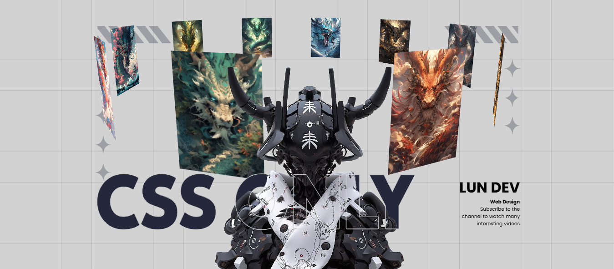

# CSS Only 3D Image Carousel 🎠

This project is a **CSS-only** 3D rotating image carousel with a stylish banner section.  
It demonstrates the power of **pure HTML & CSS** to create interactive and visually appealing animations without using JavaScript.

---

## 🚀 Features

- **3D Rotating Carousel**
  - Fully functional **auto-rotating** 3D image slider built with only CSS.
  - Uses `transform: perspective()` and `rotateY()` for a true 3D effect.
- **Responsive Design**
  - Works seamlessly across desktop, tablet, and mobile devices using CSS `@media` queries.
- **Stylish Banner**
  - Includes a large headline (`CSS ONLY`) with a **stroke effect** using `-webkit-text-stroke`.
  - Author section with name, title, and description.
- **Background Effects**
  - Subtle grid pattern created using `repeating-linear-gradient`.
  - Overlay background image to add depth.

---

## 📂 Project Structure

```

├── index.html      # Main HTML file
├── style.css       # Main CSS file
└── images/         # Folder containing carousel images and background/model images

```

- **images/bg.png** → Background pattern image.
- **images/model.png** → Model image in the banner.
- **images/dragon_1.jpg ... dragon_10.jpg** → Carousel images.

---

## ⚡ How to Use

1. **Clone or Download** the repository.
2. Place your own images inside the `images/` folder.
   - Update the `` paths if needed.
3. Open `index.html` in any modern browser to see the carousel in action.

---



---

## 🛠️ Customization

- **Number of Images**
  - Change the `--quantity` custom property in the `.slider` div to match the number of images.
- **Rotation Speed**
  - Adjust the `animation: autoRun 20s linear infinite;` in CSS to make the carousel rotate faster or slower.
- **Carousel Size**
  - Modify `translateZ()` values in `.slider .item` to change the carousel’s depth.

---

## 💡 Learning Highlights

- **CSS Variables** for dynamic positioning.
- **3D Transforms** with `rotateY` and `perspective`.
- **Responsive Layouts** using `@media` queries.
- Creative use of **background gradients** and **text stroke effects**.

---

## 📜 License

This project is for **educational and personal use**.  
Feel free to modify and experiment with the code to learn more about CSS 3D animations.

---

✨ **Created By:** LUN DEV  
Stay inspired and keep experimenting with **CSS magic**!

```

```
